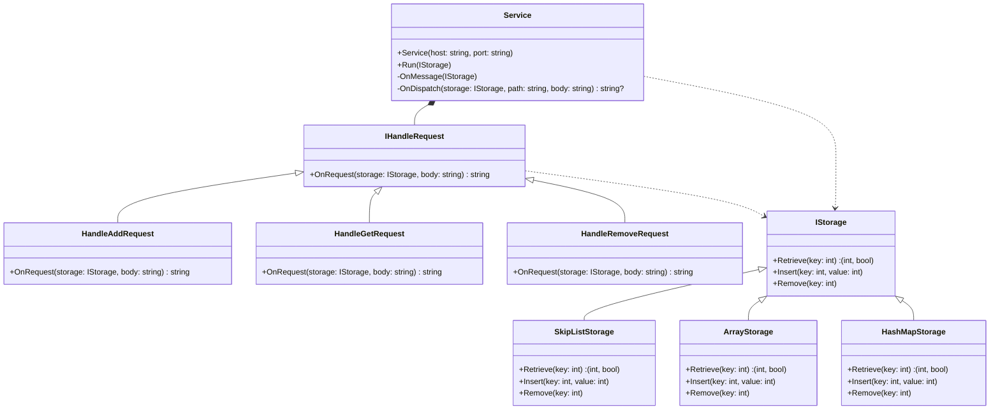

# KeyValueDB Demo

This is a simple C# exercise that demonstrates the use of the unsafe feature. 
It focuses on using pointers and direct memory access to optimize performance.
A skiplist is used in the example to show how unsafe code can work with data structures.

## Usage
The server starts on port 8080 and is ready to accept requests.
Currently it can only run on mac os due to interop for mmap


## Class Diagram



### Storing a Value

```sh
curl -X POST "http://localhost:8080/add" -H "Content-Type: application/json" -d '{"Key": 1, "Value": 200}'
```

### Retrieving a Value

```sh
curl -X POST "http://localhost:8080/get" -H "Content-Type: application/json" -d '{"Key": 1}'
```

### Deleting a Value

```sh
curl -X POST "http://localhost:8080/remove" -H "Content-Type: application/json" -d '{"Key": 1}'
```